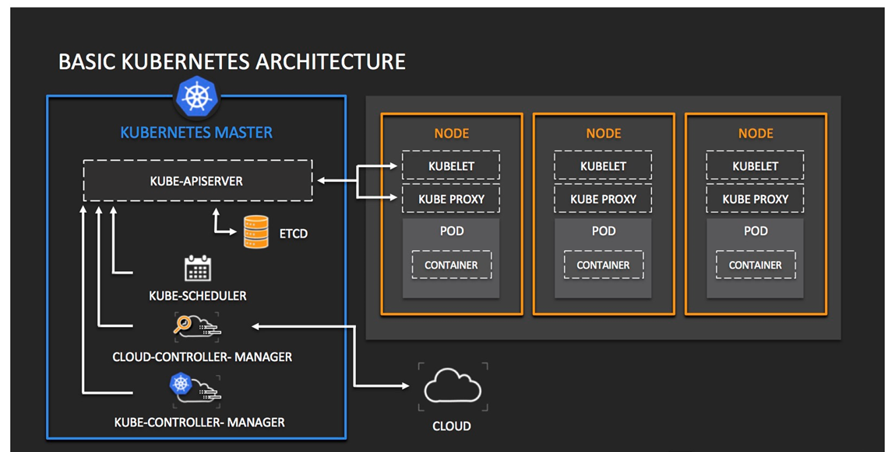

# Docker


- `sudo systemctl start docker.service` start service

#### Common Comands
- `docker run <image>` runs an image. If it doesn't find an existent image, it grabs it from the repo and downloads it.
- `docker images` shows all images on the machine
- `docker rm <image name or ID>` removes an image. Use `-f` if its running now
- `docker login` add your credentials
- `docker run -p 2368:2368 ghost` start a test website to check it works `<output on this port>:<listen on this port>`
- `docker run -d -p 2368:2368 ghost` adding `-d` runs it on the background in detached mode
- `docker ps -a` list images on your machine and shows if they are running
- `docker stop <processID>` to remove it

##### Connecting with SSH

- `sudo docker ps` check running processes

```
CONTAINER ID   IMAGE     COMMAND                  CREATED              STATUS              PORTS                               NAMES
47bd14bb7bc0   nginx     "/docker-entrypoint.…"   About a minute ago   Up About a minute   0.0.0.0:70->80/tcp, :::70->80/tcp   distracted_einstein
```

- grab the id
- `docker exec -it 47bd14bb7bc0 sh` to nter the shell

##### Copying files over
- `sudo docker cp index.html <dockeridfrom:dockerPS>:<Destination>` to docker
- `sudo docker cp <dockeridfrom:dockerPS>:<origin> <Destination>` from docker


##### Making an image
- Make a Dockerfile
```
FROM nginx                                 #what image to base our image on (add :v1 for a specific version)
LABEL MAINTAINER=contact@darkxylese.com    #optional
COPY index.html /usr/share/nginx/html
EXPOSE 80
CMD["nginx", "-g", "daemon off;"]
```

Build from Dockerfile file:
- `sudo docker build -t darkxylese/test-demo-app .` the dot means look for Dockerfile
Build from container:
- `sudo docker commit testApp` makes a container into an image

- `sudo docker tag NginxApp darkxylese/demo-app:v1` give it a tag/name
- `sudo docker push darkxylese/demo-app:v1`
Running the container
- `sudo docker run -d --name testApp -p 80:3000 darkxylese/demo-app:v1`
- `sudo docker run -d -p 600:3000 darkxylese/demo-app:v2`


### Multi container Images
#### Docker-compose

- `Docker-compose build` to build an image
- `Docker-compose up` to start

- Docker-compose is a service that is used to run multi-app containers
- One image can reference the other image by using its name
- We use link attributes to connect two services
- One image can depend on another image running first
- Can run health checks and only launch CMD commands after a successful health check ping
- The file has to be called docker-compose.yml
- Command prefixes are docker-compose

Example docker-compose.yml
```
version: "3"
services:
      mongo:
            container_name: mongo
            image: mongo
            volumes:
              - ./data:/data/db
            ports:
              - '27018:27017'
            healthcheck:
              test: echo 'db.runCommand("ping").ok' | mongo mongo:27017/posts --quiet
              interval: 5s
              timeout: 5s
              retries: 8
      app:
            container_name: app
            image: darkxylese/test-nginx-app:v3
            restart: always
            ports:
              - "80:3000"
            links:
              - mongo
            depends_on:
                mongo:
                  condition: service_healthy
```


##### Building steps in a nutshell
current image is in working state
listening on required ports
copy app folder
npm install
npm install express
CMD [node, app.js]
`localhost:3000` displays node-app-home-page
add production layer
find slimmer base image
--from=app path of WORKDIR PATH:new image WORKDIR


`docker run -d -p 2000:3000 ahskhan/node-deploy-k8:v2` Grab a container
`sudo docker cp inspiring_rubin:/usr/src/app extracted-data/` pull data out of it


`sudo docker pull mongo`

`sudo docker exec -it 978ea9175fe2 node seeds/seed.js`


#### Setting up Kubernetes on Arch Linux
- We will get this done one go
```
sudo pacman -S minikube kubectl conntrack-tools
```
- check version`minikube version`
- `minikube version: v1.23.2`
#### Launching minikube
- Change to root user `sudo -i`
- Start Minikube
- We are going to use the –vm-driver=none switch.
- The rationale is we don’t want to install a Hypervisor like VirtualBox on the AWS instance, we just want minikube to run using the host
- Start command `minikube start --vm-driver=none`
- Status check `minikube status`
- `kubectl get svc`
- Expected output
```
minikube
type: Control Plane
host: Running
kubelet: Running
apiserver: Running
kubeconfig: Configured
```

### Kubernetes


- Kubernetes — also known as “k8s” or “kube” — is a container orchestration platform for scheduling and automating the deployment, management, and scaling of containerized applications.

benefits
use cases
how does it benefit the business
k8 architecture - create a diagram or google it to add to your repo to talk though the architecture
what is self healing with k8
K8 roll back - how to use it